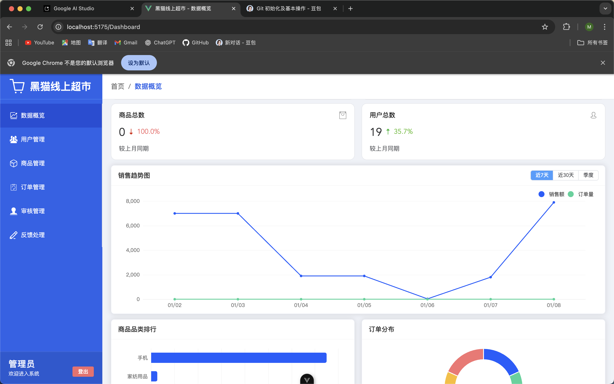
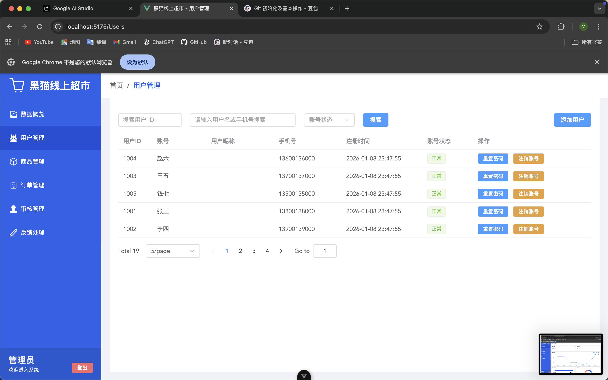
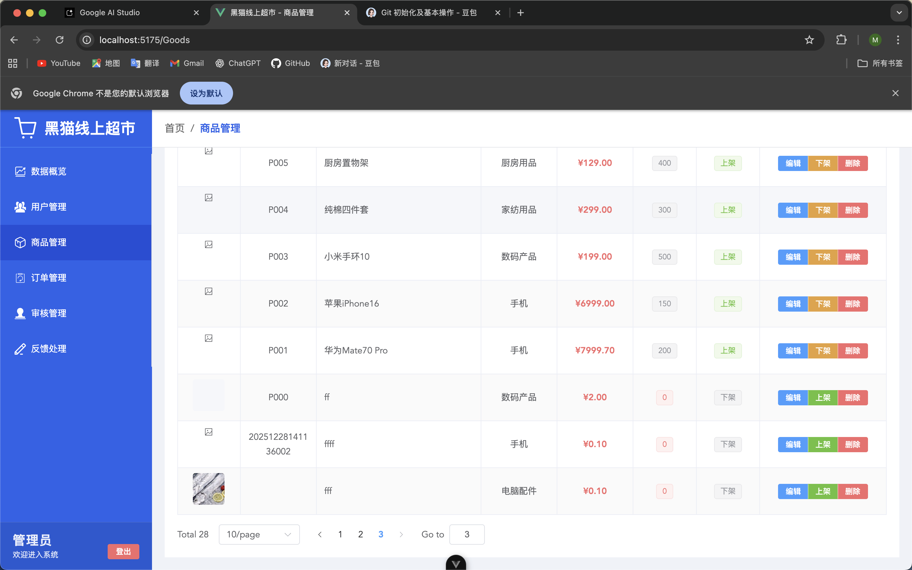
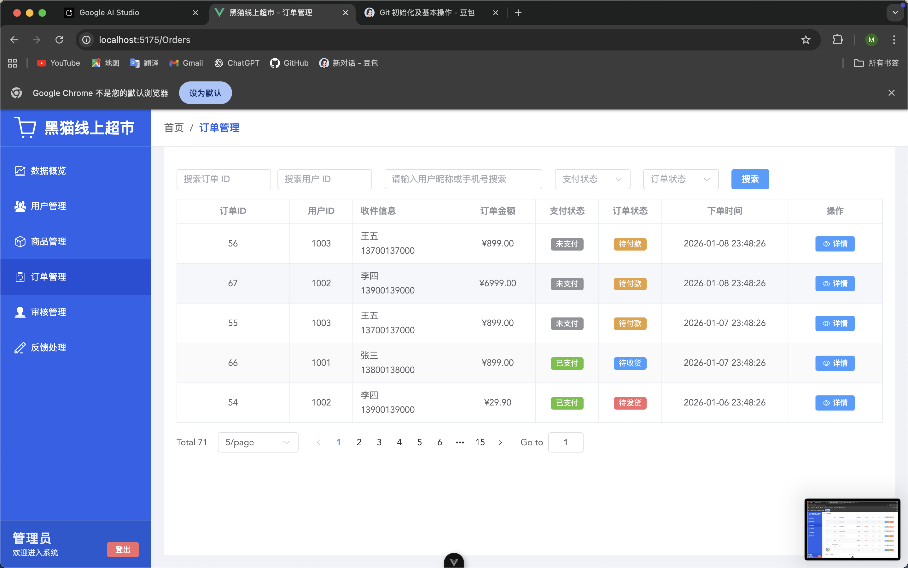
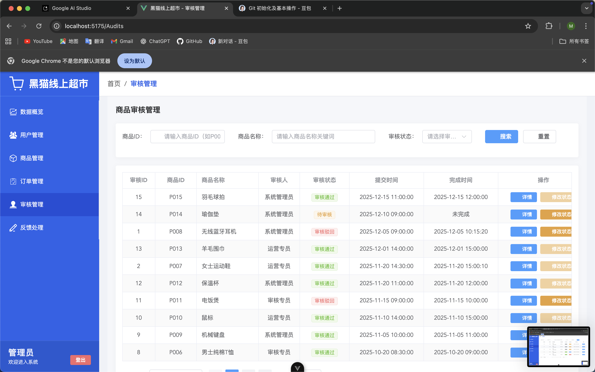
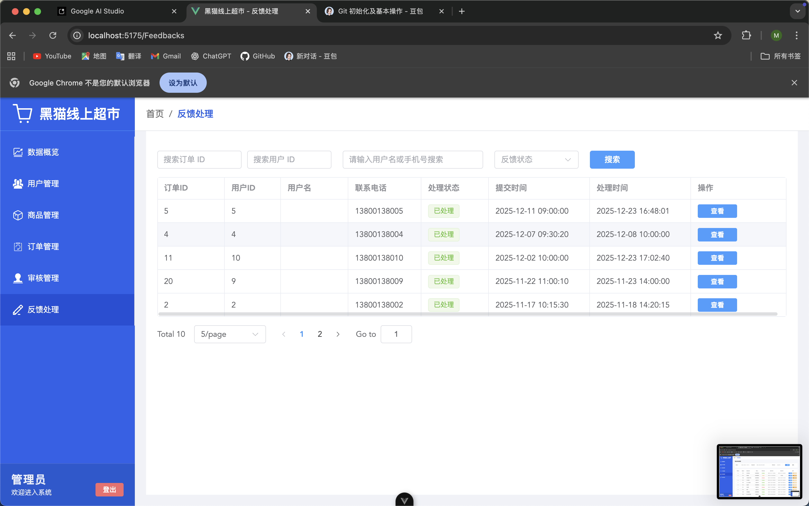

# Blackcat 项目

## 项目介绍
Blackcat 是一个基于 Spring Boot 3.4.12 构建的 Java 项目，集成了 MyBatis-Plus、阿里云 OSS 等常用组件，适用于快速开发基于 MySQL 数据库的 Web 应用。

## 技术栈
- **核心框架**：Spring Boot 3.4.12
- **Java 版本**：JDK 17
- **数据持久层**：MyBatis-Plus 3.5.7（适配 Spring Boot 3）
- **数据库**：MySQL（使用 mysql-connector-j 驱动）
- **对象存储**：阿里云 OSS（aliyun-sdk-oss 3.17.4）
- **简化开发**：Lombok
- **Web 容器**：内置 Tomcat（依赖 jakarta.servlet-api 6.0.0）


## 快速开始

### 1. 环境准备
- 安装 JDK 17
- 安装 Maven 3.6+
- 安装 MySQL 8.0+

### 2. 配置修改
在 `application.yml`（或 `application.properties`）中配置：
```yaml
# 数据库配置
spring:
  datasource:
    url: jdbc:mysql://localhost:3306/blackcat?useUnicode=true&characterEncoding=utf8&serverTimezone=Asia/Shanghai
    username: root
    password: your-password
    driver-class-name: com.mysql.cj.jdbc.Driver

# 阿里云 OSS 配置
aliyun:
  oss:
    endpoint: your-oss-endpoint
    accessKeyId: your-access-key-id
    accessKeySecret: your-access-key-secret
    bucketName: your-bucket-name
```
## 核心功能模块
### 1. 数据概览
- 展示商品总数、用户总数等基础运营指标，直观感知核心数据的增减趋势；
- 支持按"近 7 天 / 近 30 天 / 季度"切换时间维度，以折线图同步展示「销售额」「订单量」双维度趋势；
  可清晰识别销售波动节点（如销量骤增 / 骤降日期），辅助追溯波动原因。
- 以条形图展示各商品品类的数量占比（如手机、家居用品等品类的商品数排行）；
- 以饼图呈现不同订单状态（如待付款、待发货、已完成等）的占比
### 2. 管理模块
- 多维度查询：支持关键词搜索、用户ID、状态等进行搜索
- 信息全景展示：表格化呈现数据的核心信息，直观掌握相关数据的基础信息与运营状态。
## 项目前端截图
### 1.数据概览（多方面展示店铺相关运营基础数据）

### 2.用户管理

### 3.商品管理（支持OSS云存储）

### 4.订单管理

### 5.审核管理（处理商品上架、用户退款等）

### 6.反馈处理（处理商品、订单等投诉）

